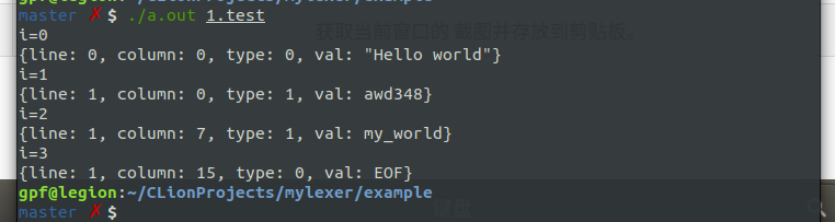

一个简单的词法分析器，用法类似于flex。根据语法文件读取规则，根据各个规则的正则表达式创建NFA，然后转化为DFA。根据不同的结束状态建立规则=>状态映射关系。最后生成一个词法分析类。

DFA采用二维矩阵存储。


Build:

```shell
mkdir build
cd build
cmake ..
make
```

语法规则定义如下:

%include {...}

#rule 

[a-z] => IDENT

#skip 

[\t\n ]+ => WS

%code{...}


生成的Lexer有两个接口，Scan返回一个token, Scan2返回一个不是跳过的token.Token定义如下:

```c++
class Token {
public:
    Token(int t, int l, int c, const char* p, const char* q): type(t),line(line),column(c){
        sval = std::move(std::string(p,q-p));
    }

    std::string toString();

    int type;
    int line;
    int column;
    std::string sval;
};

```

Run:

```bash
cd example
./mylexer word.l
g++ world.cpp
./a.out
```




